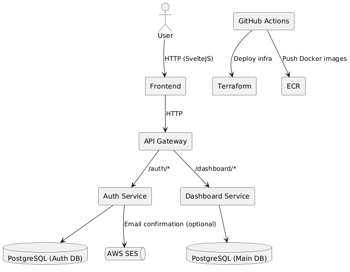

# Go Dashboard Application

## Background

This project was initiated as a personal learning exercise to explore modern software architecture practices, particularly microservice design, infrastructure-as-code, and full-stack deployment on AWS. The goal is to create a lightweight SaaS starter platform that includes basic functionality such as user authentication, data storage, and a user-facing dashboard. The system will be built using open-source technologies and cloud-native tools with an emphasis on automation, scalability, and clean separation of concerns.
The platform should serve as a base that can later evolve into a more complex application, such as a CRM, analytics dashboard, or admin panel.

## Requirements

For the MVP version of the platform, the focus is on delivering only the essential features necessary to support a working, extensible system.

- User registration and authentication via email/password
- Individual dashboard per authenticated user
- RESTful API for user-specific data with full CRUD support
- Microservice architecture with clear service boundaries
- Automated deployment to AWS using GitHub Actions and Terraform
- Persistent storage using PostgreSQL
- Service discovery and centralized API gateway

## Method

The system is built using a microservice architecture deployed on AWS ECS Fargate, with infrastructure managed via Terraform. The design emphasizes separation of concerns, scalability, and ease of deployment. Below is a high-level architecture diagram.



### Microservices Overview

- Frontend: Built with SvelteJS and deployed as a static site via AWS S3 + CloudFront.
- Auth Service: Handles user registration, login, password hashing and JWT token generation.
- Dashboard Service: Manages user-owned data with CRUD APIs, isolated per user.
- API Gateway: Routes requests to the appropriate services and enforces authentication middleware.
- PostgreSQL: Two logical schemas or two separate instances (Auth DB & Main DB).
- CI/CD: GitHub Actions pipelines for testing, building Docker images, and Terraform-based deployment to AWS ECS.

### Database Schema

The application uses PostgreSQL with two logical schemas: `auth` for authentication-related data and `dashboard` for user-specific content.

#### `auth.users` table

```sql
CREATE TABLE auth.users (
  id UUID PRIMARY KEY DEFAULT gen_random_uuid(),
  email TEXT UNIQUE NOT NULL,
  password_hash TEXT NOT NULL,
  created_at TIMESTAMP WITH TIME ZONE DEFAULT now(),
  updated_at TIMESTAMP WITH TIME ZONE DEFAULT now()
);
```

`dashboard.entries` table

Represents arbitrary user-generated data (e.g., notes, records, etc.) tied to each authenticated user.

```sql
CREATE TABLE dashboard.entries (
  id UUID PRIMARY KEY DEFAULT gen_random_uuid(),
  user_id UUID REFERENCES auth.users(id) ON DELETE CASCADE,
  title TEXT NOT NULL,
  content TEXT,
  created_at TIMESTAMP WITH TIME ZONE DEFAULT now(),
  updated_at TIMESTAMP WITH TIME ZONE DEFAULT now()
);
```

Each entry belongs to a specific user. The tables are separated by schema to improve service modularity and make it easier to restrict database access at the microservice level.

### API Endpoints

The system provides RESTful APIs via two main microservices: Auth Service and Dashboard Service. All requests are routed through the API Gateway.

#### Auth Service

Base URL: `/auth`

| Method | Endpoint     | Description                     | Auth Required |
|--------|--------------|----------------------------------|---------------|
| POST   | `/register`  | Register a new user              | No            |
| POST   | `/login`     | Log in and receive JWT token     | No            |
| GET    | `/me`        | Get authenticated user info      | Yes           |

Example request to register:
```http
POST /auth/register
Content-Type: application/json

{
  "email": "user@example.com",
  "password": "supersecurepassword"
}
```

**Dashboard Service**

Base URL: `/dashboard`

| Method | Endpoint       | Description                  | Auth Required |
| ------ | ---------      | ------------                 | ------------- |
| GET    | `/entries`     | Get all entries for the user | Yes           |
| POST   | `/entries`     | Create a new entry           | Yes           |
| GET    | `/entries/:id` | Get a specific entry         | Yes           |
| PUT    | `/entries/:id` | Update a specific entry      | Yes           |
| DELETE | `/entries/:id` | Delete a specific entry      | Yes           |

```http
POST /dashboard/entries
Authorization: Bearer <jwt-token>
Content-Type: application/json

{
  "title": "Sample Entry",
  "content": "This is a test entry"
}
```

### Authentication via JWT

Once a user logs in successfully, the Auth Service returns a JWT (JSON Web Token). This token is then included in the `Authorization` header of every request to protected endpoints.

### JWT Structure

The JWT payload contains:

```json
{
  "sub": "user-uuid",
  "email": "user@example.com",
  "iat": 1712600000,
  "exp": 1712686400
}
```

- `sub`: the user's UUID
- `email`: for convenience
- `iat` / `exp`: issued at and expiration timestamps

The JWT is signed using a secret known only to the Auth Service and verified by the API Gateway or any internal service that requires authentication.

### Middleware Flow

All protected endpoints must pass through a JWT authentication middleware.


Once validated, the middleware extracts the sub (user ID) and injects it into the request headers for downstream services to use (e.g., Dashboard Service).

This approach avoids making a network call to Auth Service for each request, ensuring performance and decoupling.

### Infrastructure Overeview (Terraform)

The infrastructure is provisioned using Terraform and follows a modular structure to separate responsibilities. The platform uses AWS ECS Fargate for container orchestration and PostgreSQL via Amazon RDS.

#### Key AWS Components

- **VPC**: Custom virtual network with private and public subnets.
- **ALB** (Application Load Balancer): Public entry point routing to ECS services.
- **ECS (Fargate)**: Serverless container hosting for each microservice.
- **RDS (PostgreSQL)**: Managed database service.
- **S3 + CloudFront**: Static site hosting for the SvelteJS frontend.
- **Secrets Manager / Parameter Store**: For managing JWT secrets and DB credentials.
- **IAM Roles**: Fine-grained permissions per service.

#### Terraform Structure

```
terraform/
├── main.tf
├── variables.tf
├── outputs.tf
└── modules/
    ├── vpc/
    ├── ecs/
    ├── rds/
    ├── alb/
    └── s3_frontend/
```

Each module encapsulates a set of reusable infrastructure logic. For example, the `ecs/` module handles ECS services, task definitions, and load balancer target groups.

#### Deployment Targets

- **Auth Service**: Containerized microservice deployed behind ALB listener on `/auth/*`
- **Dashboard Service**: Same, but on `/dashboard/*`
- **Frontend**: Built and uploaded to S3, exposed via CloudFront
